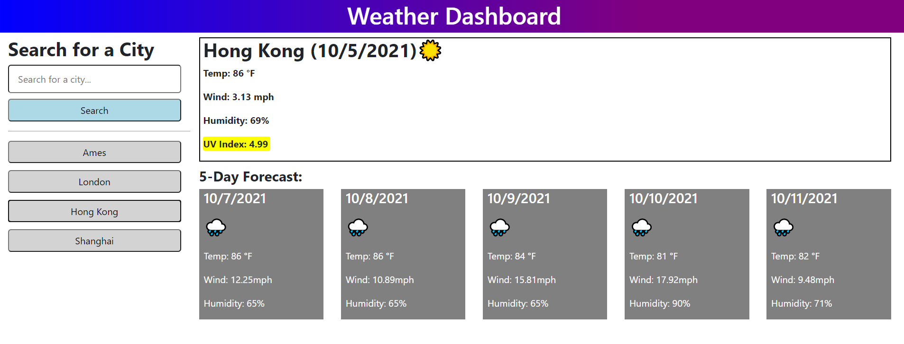

# Weather-Application-by-Vince
Use this webpage to view the weather in various cities

### Website Features:
1) A current day and five future day's forecast
2) Local storage feature that auto populates previous results into searchable buttons
3) An enter button will submit text as well as the submit button
4) A new search that is the same as an old search will not create a new button element
5) Icons are added to give general weather information from the API to the user
6) UV readout shows a green yellow or red banner based on intensity

### What I learned from the creation of this site:
* How to use APIs and link them together with promises
* How to create new button elements with event listeners
* Using the enter button to submit a textbox
* How to read inside of an API object and extract the needed information
* Much better understanding of functions
* How to display weather emojis dynamically through JavaScript

Want to look at a city's weather from all around the world? [Check it out HERE!](https://vincentmomot.github.io/Weather-Application-by-Vince)

Screenshots of the site:
